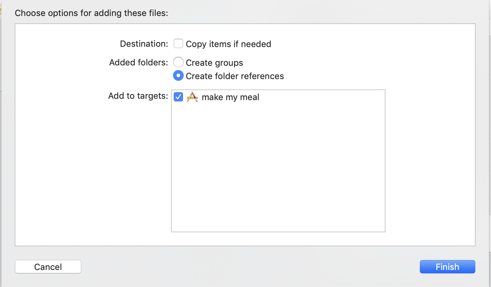

# Project 3

Make My Meal

How to set up the project:

1. Download the Resnet50.mlmodel file.

The Resnet50 File can be downloaded here:

https://docs-assets.developer.apple.com/coreml/models/Image/ImageClassification/Resnet50/Resnet50.mlmodel

NOTE: If the link is not working, visit:

https://developer.apple.com/machine-learning/models/

Find Resnet50 and download Resnet50.mlmodel

2. Open the project file.

3. You will see a placeholder Resnet50.mlmodel; delete that file and drag and drop your downloaded file in that same directory.
 

4. The screen below will be shown. Press finish.

5. Build and run the project!

Enjoy!
